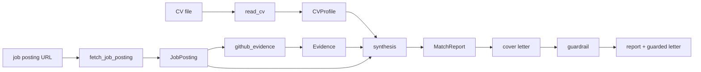

# apply-scout

**An LLM agent that matches a job posting against a candidate's CV and GitHub evidence —
with a from-scratch tool loop, safety budgets, and a trajectory-evaluation harness.**

Portfolio project **P3** (the flagship). Given a job-posting URL, apply-scout fetches and
structures the requirements, compares them against the candidate's CV and the evidence in
their GitHub repositories, and produces a **match report** (requirement → evidence → rating,
with links) and a **cover-letter draft built only from facts it can cite**. It runs on a
tool loop written from scratch — no agent framework — so that safety budgets, a
machine-readable trajectory log, and a proper evaluation are possible.

> Status: **complete (milestones 1–8) — published, with a real evaluation that anyone can re-run.**
> The full agent, the three real tools, the structured deliverables, the measured anti-hallucination
> guardrail, and the evaluation harness are built and tested (124 tests, no network or key required).
> The table under **Evaluation** comes from a real paid run over 8 annotated postings on two models —
> and every external response is **recorded to a committed cassette**, so `--cassette-mode replay`
> reproduces that exact table offline, with no API key and at no cost. CI does this on every
> pull request and every push to `main`.

## Why it's built this way

- **A tool loop written from scratch (no LangChain).** A deliberate, defensible choice: full
  control over the control flow is what makes safety budgets, the trajectory log, and systematic
  evaluation possible. See [ADR-0001](docs/decisions/0001_own_loop_vs_framework.md).
- **Safety budgets.** Every run is bounded by `max_steps`, `max_tokens`, and `max_cost`. Exceeding
  a ceiling is a **controlled stop with a partial report**, never a crash.
- **A trajectory for every run.** Each model call, tool call, and its cost is logged as JSONL — the
  substrate the evaluation harness reads. *95% of junior agent projects stop at "it worked on my
  example"; this one measures.*
- **Evidence or nothing.** A report/letter claim must trace to a real, checkable link. A requirement
  with no evidence is rated `none`; a cover-letter sentence citing a link not in the report is
  **removed by the guardrail** — the gap is reported, not hidden.
- **Two models, honestly compared.** The harness runs a cheap model (`claude-haiku-4-5`) and a
  strong one (`claude-opus-4-8`) to answer *"when is the cheaper model enough?"*.

## Architecture



Two orchestration paths share the same tools and contracts:

- **The agent loop** (`runner` → `agent`) lets the model decide which tools to call, bounded by
  the **budgets** and recorded as a **trajectory**. This is the agentic showcase (`apply-scout run`).
- **The deterministic pipeline** (`pipeline.assess`) runs the tools in a fixed order to reliably
  produce the structured deliverables + the guardrail measurement. This is what the **eval harness
  scores**.

Every component depends only on injected collaborators (an `LLMClient`, an `HttpFetcher`, a
`GitHubClient`, a `Structurer`), so the whole system runs under scripted fakes with **no network and
no API key** — which is exactly how the tests drive it.

## Install & test

```bash
python -m venv .venv
.venv/Scripts/python -m pip install -e ".[dev]"   # Windows
pytest        # 124 tests, all under fakes — no ANTHROPIC_API_KEY needed
ruff check .
```

## Usage

Real runs read `ANTHROPIC_API_KEY` from the environment (and optionally `GITHUB_TOKEN` for a higher
GitHub rate limit).

Copy `.env.example` to `.env` and fill it in — the CLI loads it at startup, and an already-exported
variable wins.

```bash
# Assess fit for one posting (agent loop): streams each step, writes the trajectory JSONL.
apply-scout run --url <posting-url> --cv path/to/cv.md --github-user <user> --verbose

# Score a set of annotated tasks and write a markdown comparison table.
apply-scout eval --tasks eval/tasks.json --models claude-haiku-4-5,claude-opus-4-8
```

Both subcommands accept `--cassette-mode {off,record,replay,auto}` (and `--cassette PATH`):
`record` calls the real services and stores every response, `replay` serves them back with **no network
and no key**, and `auto` replays what is recorded while recording what is not — so extending a task set
only pays for the new tasks. See [Reproducibility](#reproducibility--record-once-replay-forever).

## Evaluation

The harness scores each annotated task (see [`eval/tasks.example.json`](eval/tasks.example.json) for
the format, including edge cases: English postings, no salary range, JS-only pages, repos without a
README) and writes a markdown table comparing two models:

| Model | Tasks | Completed | Req F1 | Citation fidelity | Median LLM calls | Median cost |
|---|---|---|---|---|---|---|
| `claude-haiku-4-5` | 8 | 75% | 0.33 | 0.83 | 4 | $0.0291 |
| `claude-opus-4-8` | 8 | 75% | 0.23 | 1.00 | 4 | $0.1827 |

> Real numbers from `apply-scout eval` (2026-08-21) over 8 annotated live postings — 6 English and 2 Polish,
> from Lever / Greenhouse / SmartRecruiters, plus one deliberately JavaScript-only page as an edge case.
> Each row runs one model end-to-end. **Reproduce for free, with no API key:**
> `apply-scout eval --tasks eval/tasks.json --models claude-haiku-4-5,claude-opus-4-8 --cassette-mode replay`.

**Why "Completed" is 75% and not 100%.** Two of the eight postings — The Athletic and HHAeXchange —
now return **HTTP 404**: the ads were taken down between the first run (2026-07-27, when all eight
resolved) and this one. Nothing in the pipeline regressed; the *web* changed underneath the task set.
That is precisely the failure this milestone set out to fix, and it is the reason the numbers above are
recorded rather than merely reported — see **Reproducibility** below.

**What each metric means (and why):**

- **Completed** — did the run produce a report + letter without a fatal error. Catches brittleness on
  edge-case postings.
- **Req F1** — set F1 of the extracted requirements against a human annotation. Measures how well the
  posting was actually understood, not just fetched. It is an **exact set-match after case-folding**, so a
  paraphrase or a coarser/finer split counts as a miss — read the ~0.3 scores as a strict lower bound on
  extraction quality, not as a failure to read the posting.
- **Citation fidelity** — of the letter's sentences that cite evidence, the fraction whose citation is
  a real link from the report. The anti-hallucination guardrail computes this deterministically; a
  low number means the model was inventing citations. **Haiku scores 0.83 here and Opus 1.00** — the
  guardrail caught and removed fabricated citations from the cheap model's letters. This is the metric
  earning its keep: the gap is invisible to a human skim of the output.
- **Median LLM calls / cost** — the price of a task, per model. This is the "cheaper model enough?"
  question made quantitative.

## Reproducibility — record once, replay forever

The evaluation runs against live job postings and a paid API. Both decay: ads get taken down (two of
these eight already have), and re-running the numbers costs money every time. An evaluation nobody can
re-run is a claim, not a measurement.

So every outbound seam — the model transport, the structuring calls, the HTTP fetch, and the GitHub API
— is wrapped by [`cassette.py`](src/apply_scout/cassette.py), which records what came back into a
**committed** JSONL cassette ([`eval/cassettes/`](eval/cassettes/)) and serves it again on replay.
Main-text extraction is recorded too, even though it never leaves the machine: trafilatura's output
shifts between its own versions and libxml2 builds, so a replay that re-ran it would key its
structuring request off different text and miss every entry behind it — which is exactly what CI
caught on a runner with a newer trafilatura.

```bash
apply-scout eval --tasks eval/tasks.json --models claude-haiku-4-5,claude-opus-4-8 \
  --cassette-mode replay      # no network, no ANTHROPIC_API_KEY, $0.00
```

- **Replay never falls back to the network.** An unrecorded request raises `CassetteMiss` and stops the
  run. Quietly serving it live would turn a reproducible evaluation back into a paid, unverifiable one.
- **Cost survives the offline path.** Token counts and USD are replayed from what was captured *at
  recording time*, so the cost column above is real measurement, not a zero.
- **A prompt edit invalidates exactly what it touches.** The cassette key hashes the whole request,
  system prompt included — so the project's "change a prompt ⇒ re-run the harness" rule is enforced by
  the machinery instead of by memory.
- **CI replays it on every pull request and every push to `main`**, which turns the published table
  into a regression test.

Recording the whole 8-posting × 2-model table cost **$0.88** and produced 68 entries (40 structuring
calls, 8 pages, 6 extractions, 14 GitHub responses). Every reproduction since has been free.

## Cost analysis

Each eval row runs one model end-to-end, and every model call's token usage flows through one
`token_cost()` helper, so per-task cost is measured, not estimated. For this task set the result is
unambiguous: **`claude-opus-4-8` costs ≈6× more per task than `claude-haiku-4-5` ($0.1827 vs $0.0291)
and does not buy a better match report** — identical completion (75%, both blocked by the same two dead
URLs) and a *lower* requirement-F1 (0.23 vs 0.33). The one place the strong model does win is
**citation fidelity — 1.00 against Haiku's 0.83**: Haiku invents citations that the guardrail then has
to strip. So the honest reading is a split decision: **Haiku is the better default for extraction and
matching, and the money is better spent on the letter, where fabrication actually shows up.** That is
exactly how `config.py` wires it in production — `STRUCTURE_MODEL` extracts cheaply, the agent model
synthesises — so the two-model story is a lever, not only a benchmark.

## Limitations — what apply-scout can't do

Honest and specific, because an agent that hides its failure modes is worse than one that names them:

- **JavaScript-only postings.** `fetch_job_posting` fetches static HTML with no headless browser, so a
  client-rendered page yields only its pre-hydration shell. In the eval, the deliberately JavaScript-only
  Ashby posting still *completed* on both models — the pipeline is robust to thin input rather than
  crashing — but there was almost no text to read, so any requirements reported for such a page are
  unreliable.
- **Evidence is repo + README only.** `github_evidence` matches a requirement against repo metadata
  and README text — not full code search. A skill demonstrated only deep in a source file, with no
  mention in the README, is missed (rated `none`, honestly).
- **Extraction is only as good as the model.** Odd posting layouts can drop or merge requirements; the
  Req F1 metric exists precisely to quantify this rather than assume it away.
- **The guardrail checks citations, not truth.** It removes sentences citing links absent from the
  report; it does not fact-check a grounded claim's phrasing. It bounds hallucinated *citations*, not
  every possible overstatement.
- **The live task set decays.** Job ads are removed; two of these eight 404 within a month of being
  annotated. The cassette makes past results reproducible, but it cannot keep the *task set* fresh —
  extending or refreshing it means new annotation and a new paid recording.
- **A cassette is a snapshot, not a guarantee of current behaviour.** Replay proves what the models did
  on the recorded requests, not what they would do today. Re-record to make that claim.
- **A long report can outgrow one response.** `MAX_OUTPUT_TOKENS` caps a single model reply at 4096
  tokens, which a posting with two dozen requirements exceeds. The loop asks the model to continue
  (up to `MAX_CONTINUATIONS`) and stitches the pieces into one report; if it runs out of
  continuations the run ends `truncated`, never `completed`. What it cannot do is finish a report
  the safety budget has no money left to pay for — as in the demo above, where the cost ceiling
  stops the continuation and the deliverable stays partial.
- **A budget can be overshot by one call.** Ceilings are checked *before* each model call, so a
  single expensive reply can end a run above its limit ($0.5948 against a $0.50 ceiling in the
  demo). The stop is still graceful and honest; it is a ceiling on starting work, not a hard cap on
  spend.
- **English/Polish postings assumed.** Other languages are untested.
- **No application is ever submitted.** apply-scout drafts a report and a letter for a human to review
  and send — it does not act on the candidate's behalf.

## Design decisions

- [ADR-0001 — a from-scratch tool loop, not a framework](docs/decisions/0001_own_loop_vs_framework.md)
- [ADR-0002 — a deterministic pipeline alongside the agent loop](docs/decisions/0002_pipeline_vs_agent_loop.md)
- [ADR-0003 — structured outputs with our own validate-and-retry, and a deterministic guardrail](docs/decisions/0003_structured_outputs_and_guardrail.md)
- [ADR-0004 — record/replay cassettes at our own seams, not at the HTTP layer](docs/decisions/0004_record_replay_cassettes.md)

## Demo

A real `apply-scout run` against a live posting (Jeeves — *Senior AI Engineer*), matched against the
synthetic candidate CV (`cv/candidate.md`) and the public `P0w3r223` GitHub:



Recorded live on 2026-08-21 against `claude-opus-4-8` (**8 model calls, 56 `github_evidence` probes,
68.9k+10.0k tokens, $0.5948, 138 s**), then **rendered from a replay of that recording** — which is
why the steps are evenly paced: a replay has no thinking time to show. Repeated probes are folded up
with an explicit count (`... 7 more github_evidence call(s)`) and one frame contributes at most six
rows; nothing is edited or reordered.

**Reproduce it yourself — offline, in under a second, with no API key:**

```bash
python scripts/demo.py capture --url https://jobs.lever.co/tryjeeves/2f00206f-6091-4eed-8b5f-1325afdbfe30 \
  --cv cv/candidate.md --github-user P0w3r223 --cassette-mode replay
python scripts/demo.py render
```

The replay reproduces the recorded stream **character for character** — 0.4 s instead of 138 s, $0
instead of $0.59 — because every external seam of that run is committed in
`eval/cassettes/run.jsonl` (see [ADR-0004](docs/decisions/0004_record_replay_cassettes.md)).

Three things the run shows, including one that is not flattering:

- **It self-corrects.** The first 26 probes use long requirement phrases and return nothing; the agent
  notices ("the search appears to favor short/specific terms"), retries with single keywords —
  `MLflow`, `drift`, `FastAPI`, `RAG` — and starts hitting real repos.
- **It rates honestly.** Requirements with no retrieved evidence come back `none`, including
  "5+ years professional experience", which no repository can prove. It cites this project's *own*
  audit against itself rather than papering over the gap.
- **Both safety mechanisms fire, and the run says so.** A 24-requirement report does not fit in one
  reply (`MAX_OUTPUT_TOKENS = 4096`), so the loop asks the model to continue where it stopped —
  `[...] output cap reached; continuing (1/2)`. That continuation would be the ninth model call, and
  the run has already spent $0.5948 against a $0.50 ceiling, so the budget check stops it first. The
  run ends **`budget_stopped (breach: max_cost)` with a partial report** — not `completed`. A
  truncated deliverable is never reported as a finished one.

## License

MIT — see [LICENSE](LICENSE).
