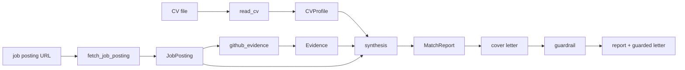

# apply-scout

**An LLM agent that matches a job posting against a candidate's CV and GitHub evidence —
with a from-scratch tool loop, safety budgets, and a trajectory-evaluation harness.**

Portfolio project **P3** (the flagship). Given a job-posting URL, apply-scout fetches and
structures the requirements, compares them against the candidate's CV and the evidence in
their GitHub repositories, and produces a **match report** (requirement → evidence → rating,
with links) and a **cover-letter draft built only from facts it can cite**. It runs on a
tool loop written from scratch — no agent framework — so that safety budgets, a
machine-readable trajectory log, and a proper evaluation are possible.

> Status: **complete (milestones 1–7).** The full agent, the three real tools, the structured
> deliverables, the measured anti-hallucination guardrail, and the evaluation harness are built
> and tested (73 tests, no network or key required). Populating the eval table with real numbers
> needs an `ANTHROPIC_API_KEY` and a set of annotated postings — see **Evaluation** below.

## Why it's built this way

- **A tool loop written from scratch (no LangChain).** A deliberate, defensible choice: full
  control over the control flow is what makes safety budgets, the trajectory log, and systematic
  evaluation possible. See [ADR-0001](docs/decisions/0001_own_loop_vs_framework.md).
- **Safety budgets.** Every run is bounded by `max_steps`, `max_tokens`, and `max_cost`. Exceeding
  a ceiling is a **controlled stop with a partial report**, never a crash.
- **A trajectory for every run.** Each model call, tool call, and its cost is logged as JSONL — the
  substrate the evaluation harness reads. *95% of junior agent projects stop at "it worked on my
  example"; this one measures.*
- **Evidence or nothing.** A report/letter claim must trace to a real, checkable link. A requirement
  with no evidence is rated `none`; a cover-letter sentence citing a link not in the report is
  **removed by the guardrail** — the gap is reported, not hidden.
- **Two models, honestly compared.** The harness runs a cheap model (`claude-haiku-4-5`) and a
  strong one (`claude-opus-4-8`) to answer *"when is the cheaper model enough?"*.

## Architecture



Two orchestration paths share the same tools and contracts:

- **The agent loop** (`runner` → `agent`) lets the model decide which tools to call, bounded by
  the **budgets** and recorded as a **trajectory**. This is the agentic showcase (`apply-scout run`).
- **The deterministic pipeline** (`pipeline.assess`) runs the tools in a fixed order to reliably
  produce the structured deliverables + the guardrail measurement. This is what the **eval harness
  scores**.

Every component depends only on injected collaborators (an `LLMClient`, an `HttpFetcher`, a
`GitHubClient`, a `Structurer`), so the whole system runs under scripted fakes with **no network and
no API key** — which is exactly how the tests drive it.

## Install & test

```bash
python -m venv .venv
.venv/Scripts/python -m pip install -e ".[dev]"   # Windows
pytest        # 73 tests, all under fakes — no ANTHROPIC_API_KEY needed
ruff check .
```

## Usage

Real runs read `ANTHROPIC_API_KEY` from the environment (and optionally `GITHUB_TOKEN` for a higher
GitHub rate limit).

```bash
# Assess fit for one posting (agent loop): streams each step, writes the trajectory JSONL.
apply-scout run --url <posting-url> --cv path/to/cv.md --github-user <user> --verbose

# Score a set of annotated tasks and write a markdown comparison table.
apply-scout eval --tasks eval/tasks.json --models claude-haiku-4-5,claude-opus-4-8
```

## Evaluation

The harness scores each annotated task (see [`eval/tasks.example.json`](eval/tasks.example.json) for
the format, including edge cases: English postings, no salary range, JS-only pages, repos without a
README) and writes a markdown table comparing two models:

| Model | Tasks | Completed | Req F1 | Citation fidelity | Median LLM calls | Median cost |
|---|---|---|---|---|---|---|
| `claude-haiku-4-5` | — | — | — | — | — | — |
| `claude-opus-4-8` | — | — | — | — | — | — |

> The table above is the **shape**; `apply-scout eval` fills the numbers from a real run. It is left
> unpopulated rather than filled with invented results.

**What each metric means (and why):**

- **Completed** — did the run produce a report + letter without a fatal error. Catches brittleness on
  edge-case postings.
- **Req F1** — set F1 of the extracted requirements against a human annotation. Measures how well the
  posting was actually understood, not just fetched.
- **Citation fidelity** — of the letter's sentences that cite evidence, the fraction whose citation is
  a real link from the report. The anti-hallucination guardrail computes this deterministically; a
  low number means the model was inventing citations.
- **Median LLM calls / cost** — the price of a task, per model. This is the "cheaper model enough?"
  question made quantitative.

## Cost analysis

Cost is separated by role: the cheap model does the **extraction** (fetch + CV structuring), the
stronger model does the **synthesis** (report + letter). Every model call's token usage flows through
one `token_cost()` helper, so per-task cost is measured, not estimated. Running `apply-scout eval`
across both models yields the median-cost column above — the basis for a *"when is Haiku enough?"*
conclusion.

## Limitations — what apply-scout can't do

Honest and specific, because an agent that hides its failure modes is worse than one that names them:

- **JavaScript-only postings.** `fetch_job_posting` fetches static HTML; a page that renders its
  content client-side yields no text and the tool returns a readable error. No headless browser.
- **Evidence is repo + README only.** `github_evidence` matches a requirement against repo metadata
  and README text — not full code search. A skill demonstrated only deep in a source file, with no
  mention in the README, is missed (rated `none`, honestly).
- **Extraction is only as good as the model.** Odd posting layouts can drop or merge requirements; the
  Req F1 metric exists precisely to quantify this rather than assume it away.
- **The guardrail checks citations, not truth.** It removes sentences citing links absent from the
  report; it does not fact-check a grounded claim's phrasing. It bounds hallucinated *citations*, not
  every possible overstatement.
- **English/Polish postings assumed.** Other languages are untested.
- **No application is ever submitted.** apply-scout drafts a report and a letter for a human to review
  and send — it does not act on the candidate's behalf.

## Design decisions

- [ADR-0001 — a from-scratch tool loop, not a framework](docs/decisions/0001_own_loop_vs_framework.md)
- [ADR-0002 — a deterministic pipeline alongside the agent loop](docs/decisions/0002_pipeline_vs_agent_loop.md)
- [ADR-0003 — structured outputs with our own validate-and-retry, and a deterministic guardrail](docs/decisions/0003_structured_outputs_and_guardrail.md)

## Demo

_A short GIF of `apply-scout run --verbose` on a real posting will go here once run with a live key._

## License

MIT — see [LICENSE](LICENSE).
