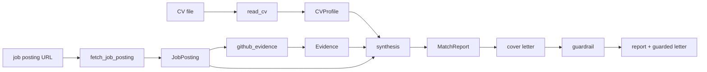

# apply-scout

**An LLM agent that matches a job posting against a candidate's CV and GitHub evidence —
with a from-scratch tool loop, safety budgets, and a trajectory-evaluation harness.**

Portfolio project **P3** (the flagship). Given a job-posting URL, apply-scout fetches and
structures the requirements, compares them against the candidate's CV and the evidence in
their GitHub repositories, and produces a **match report** (requirement → evidence → rating,
with links) and a **cover-letter draft built only from facts it can cite**. It runs on a
tool loop written from scratch — no agent framework — so that safety budgets, a
machine-readable trajectory log, and a proper evaluation are possible.

> Status: **complete (milestones 1–7) — published, with a real evaluation.** The full agent, the three
> real tools, the structured deliverables, the measured anti-hallucination guardrail, and the evaluation
> harness are built and tested (73 tests, no network or key required). The table under **Evaluation** is
> populated from a real paid run over 8 annotated postings on two models.

## Why it's built this way

- **A tool loop written from scratch (no LangChain).** A deliberate, defensible choice: full
  control over the control flow is what makes safety budgets, the trajectory log, and systematic
  evaluation possible. See [ADR-0001](docs/decisions/0001_own_loop_vs_framework.md).
- **Safety budgets.** Every run is bounded by `max_steps`, `max_tokens`, and `max_cost`. Exceeding
  a ceiling is a **controlled stop with a partial report**, never a crash.
- **A trajectory for every run.** Each model call, tool call, and its cost is logged as JSONL — the
  substrate the evaluation harness reads. *95% of junior agent projects stop at "it worked on my
  example"; this one measures.*
- **Evidence or nothing.** A report/letter claim must trace to a real, checkable link. A requirement
  with no evidence is rated `none`; a cover-letter sentence citing a link not in the report is
  **removed by the guardrail** — the gap is reported, not hidden.
- **Two models, honestly compared.** The harness runs a cheap model (`claude-haiku-4-5`) and a
  strong one (`claude-opus-4-8`) to answer *"when is the cheaper model enough?"*.

## Architecture



Two orchestration paths share the same tools and contracts:

- **The agent loop** (`runner` → `agent`) lets the model decide which tools to call, bounded by
  the **budgets** and recorded as a **trajectory**. This is the agentic showcase (`apply-scout run`).
- **The deterministic pipeline** (`pipeline.assess`) runs the tools in a fixed order to reliably
  produce the structured deliverables + the guardrail measurement. This is what the **eval harness
  scores**.

Every component depends only on injected collaborators (an `LLMClient`, an `HttpFetcher`, a
`GitHubClient`, a `Structurer`), so the whole system runs under scripted fakes with **no network and
no API key** — which is exactly how the tests drive it.

## Install & test

```bash
python -m venv .venv
.venv/Scripts/python -m pip install -e ".[dev]"   # Windows
pytest        # 73 tests, all under fakes — no ANTHROPIC_API_KEY needed
ruff check .
```

## Usage

Real runs read `ANTHROPIC_API_KEY` from the environment (and optionally `GITHUB_TOKEN` for a higher
GitHub rate limit).

```bash
# Assess fit for one posting (agent loop): streams each step, writes the trajectory JSONL.
apply-scout run --url <posting-url> --cv path/to/cv.md --github-user <user> --verbose

# Score a set of annotated tasks and write a markdown comparison table.
apply-scout eval --tasks eval/tasks.json --models claude-haiku-4-5,claude-opus-4-8
```

## Evaluation

The harness scores each annotated task (see [`eval/tasks.example.json`](eval/tasks.example.json) for
the format, including edge cases: English postings, no salary range, JS-only pages, repos without a
README) and writes a markdown table comparing two models:

| Model | Tasks | Completed | Req F1 | Citation fidelity | Median LLM calls | Median cost |
|---|---|---|---|---|---|---|
| `claude-haiku-4-5` | 8 | 100% | 0.31 | 1.00 | 4 | $0.0273 |
| `claude-opus-4-8` | 8 | 100% | 0.25 | 1.00 | 4 | $0.1995 |

> Real numbers from `apply-scout eval` (2026-07-27) over 8 annotated live postings — 6 English and 2 Polish,
> from Lever / Greenhouse / SmartRecruiters, plus one deliberately JavaScript-only page as an edge case.
> Each row runs one model end-to-end. Reproduce with
> `apply-scout eval --tasks eval/tasks.json --models claude-haiku-4-5,claude-opus-4-8` (needs an `ANTHROPIC_API_KEY`).

**What each metric means (and why):**

- **Completed** — did the run produce a report + letter without a fatal error. Catches brittleness on
  edge-case postings.
- **Req F1** — set F1 of the extracted requirements against a human annotation. Measures how well the
  posting was actually understood, not just fetched. It is an **exact set-match after case-folding**, so a
  paraphrase or a coarser/finer split counts as a miss — read the ~0.3 scores as a strict lower bound on
  extraction quality, not as a failure to read the posting.
- **Citation fidelity** — of the letter's sentences that cite evidence, the fraction whose citation is
  a real link from the report. The anti-hallucination guardrail computes this deterministically; a
  low number means the model was inventing citations.
- **Median LLM calls / cost** — the price of a task, per model. This is the "cheaper model enough?"
  question made quantitative.

## Cost analysis

Each eval row runs one model end-to-end, and every model call's token usage flows through one
`token_cost()` helper, so per-task cost is measured, not estimated. For this task set the result is
unambiguous: **`claude-opus-4-8` costs ≈7× more per task than `claude-haiku-4-5` ($0.1995 vs $0.0273)
while scoring no better** — identical completion (100%) and citation fidelity (1.00), and a slightly
*lower* requirement-F1 (0.25 vs 0.31). For extracting and matching job postings at this size, **Haiku is
not just enough — it is the better default.** (In production, `run` and the pipeline split by role via
`STRUCTURE_MODEL` in `config.py` — the cheap model extracts, the strong model synthesises — so the
two-model story is a lever, not only a benchmark.)

## Limitations — what apply-scout can't do

Honest and specific, because an agent that hides its failure modes is worse than one that names them:

- **JavaScript-only postings.** `fetch_job_posting` fetches static HTML with no headless browser, so a
  client-rendered page yields only its pre-hydration shell. In the eval, the deliberately JavaScript-only
  Ashby posting still *completed* on both models — the pipeline is robust to thin input rather than
  crashing — but there was almost no text to read, so any requirements reported for such a page are
  unreliable.
- **Evidence is repo + README only.** `github_evidence` matches a requirement against repo metadata
  and README text — not full code search. A skill demonstrated only deep in a source file, with no
  mention in the README, is missed (rated `none`, honestly).
- **Extraction is only as good as the model.** Odd posting layouts can drop or merge requirements; the
  Req F1 metric exists precisely to quantify this rather than assume it away.
- **The guardrail checks citations, not truth.** It removes sentences citing links absent from the
  report; it does not fact-check a grounded claim's phrasing. It bounds hallucinated *citations*, not
  every possible overstatement.
- **English/Polish postings assumed.** Other languages are untested.
- **No application is ever submitted.** apply-scout drafts a report and a letter for a human to review
  and send — it does not act on the candidate's behalf.

## Design decisions

- [ADR-0001 — a from-scratch tool loop, not a framework](docs/decisions/0001_own_loop_vs_framework.md)
- [ADR-0002 — a deterministic pipeline alongside the agent loop](docs/decisions/0002_pipeline_vs_agent_loop.md)
- [ADR-0003 — structured outputs with our own validate-and-retry, and a deterministic guardrail](docs/decisions/0003_structured_outputs_and_guardrail.md)

## Demo

A real `apply-scout run` against a live posting (Jeeves — *Senior AI Engineer*), matched against the
synthetic candidate CV (`cv/candidate.md`) and the public `P0w3r223` GitHub. Captured from the
`--verbose` step stream (lightly trimmed):

```text
$ apply-scout run --url https://jobs.lever.co/tryjeeves/… --cv cv/candidate.md --github-user P0w3r223 --verbose

[0]  claude-opus-4-8 | 1256+187 tok | $0.0110 | 2 tool call(s)
     I'll fetch the posting and read the CV in parallel, then gather GitHub evidence.
    - fetch_job_posting -> ok: posting 'Senior AI Engineer' with 22 requirement(s)
    - read_cv           -> ok: CV for P0w3r223 with 49 skill(s)

[3]  claude-opus-4-8 | 3613+1783 tok | $0.0626 | 18 tool call(s)
    - github_evidence -> ok: 0 evidence item(s) for 'LLM-powered applications … in production'
    - github_evidence -> ok: 0 evidence item(s) for 'RAG pipelines (chunking, embeddings, vector DB)'
    … (18 long-phrase queries, all 0)

[22] claude-opus-4-8 | 7040+883 tok | $0.0573 | 6 tool call(s)
     All eighteen returned no evidence — unusual given the CV. Let me retry with simpler terms.
    - github_evidence -> ok: 1 evidence item(s) for 'MLflow'
    - github_evidence -> ok: 8 evidence item(s) for 'Python'

[36] claude-opus-4-8 | 10639+4096 tok | $0.1556
     The GitHub tool is functioning correctly (real repos for Python, MLflow, the portfolio
     projects), so the many `none` results are genuine findings, not tool failures.

     # Match Report — Senior AI Engineer @ Jeeves
     Overall: **weak fit** — strong classical-ML / MLOps / A-B-testing evidence, but the posting's
     production-LLM, RAG, vector-DB, cloud and serving requirements have no verifiable evidence.

     | Requirement                | Rating | Evidence                                              |
     |----------------------------|--------|-------------------------------------------------------|
     | Strong Python for AI/ML    | strong | car-price-ml, pl-review-sense, mlops-car-price        |
     | ML lifecycle (MLflow, …)   | strong | mlops-car-price — MLflow tracking + registry          |
     | LLM apps in production     | weak   | token-budget references the Claude ecosystem, not a deployed app |
     | RAG / vector databases     | none   | no evidence found                                     |
     | PostgreSQL                 | none   | only SQLite evidenced (it-job-radar)                  |

status: completed | steps: 5 | tokens: 31742+7898 | cost: $0.3562
```

> A genuine run, trimmed for length. Two things it shows: the agent **self-corrects** — when its first
> descriptive queries return nothing, it retries with short tokens and finds real evidence — and it rates
> **honestly**, refusing to claim production / RAG / cloud experience the repos don't back up. The full
> trajectory is written to `eval/results/` as JSONL.

## License

MIT — see [LICENSE](LICENSE).
