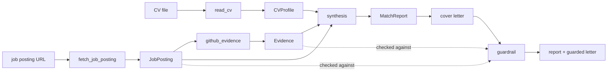
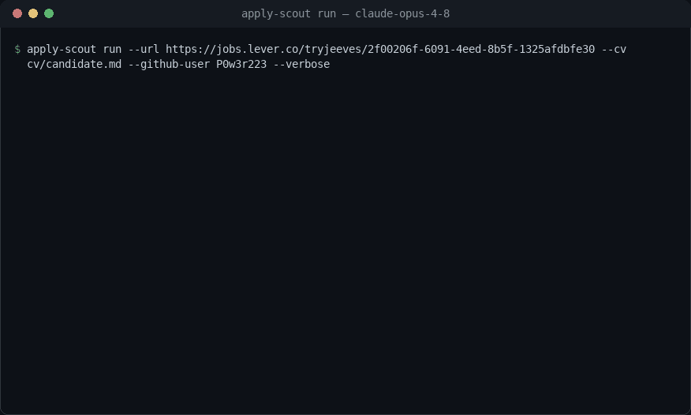

# apply-scout

**An LLM agent that matches a job posting against a candidate's CV and GitHub evidence —
with a from-scratch tool loop, safety budgets, and a trajectory-evaluation harness.**

Portfolio project **P3**. Given a job-posting URL, apply-scout fetches and
structures the requirements, compares them against the candidate's CV and the evidence in
their GitHub repositories, and produces a **match report** (requirement → evidence → rating,
with links) and a **cover-letter draft built only from facts it can cite**. It runs on a
tool loop written from scratch — no agent framework — so that safety budgets, a
machine-readable trajectory log, and a proper evaluation are possible.

> Status: **complete — published, with a real evaluation that anyone can re-run.**
> The full agent, the three real tools, the structured deliverables, the measured anti-hallucination
> guardrail, and the evaluation harness are built and tested (246 tests, no network or key required).
> The table under **Evaluation** comes from a real paid run over 8 annotated postings on two models —
> and every external response is **recorded to a committed cassette**, so `--cassette-mode replay`
> reproduces that exact table offline, with no API key and at no cost. CI does this on every
> pull request and every push to `main`.

## Why it's built this way

- **A tool loop written from scratch (no LangChain).** A deliberate, defensible choice: full
  control over the control flow is what makes safety budgets, the trajectory log, and systematic
  evaluation possible. See [ADR-0001](docs/decisions/0001_own_loop_vs_framework.md).
- **Safety budgets.** Every run is bounded by `max_steps`, `max_tokens`, and `max_cost`. Exceeding
  a ceiling is a **controlled stop with a partial report**, never a crash.
- **A trajectory for every run.** Each model call, tool call, and its cost is logged as JSONL — the
  substrate the evaluation harness reads. *95% of junior agent projects stop at "it worked on my
  example"; this one measures.*
- **Evidence or nothing.** A report/letter claim must trace to a real, checkable link. A requirement
  with no evidence is rated `none`; a cover-letter sentence citing a link not in the report is
  **removed by the guardrail** — the gap is reported, not hidden.
- **Two models, honestly compared.** The harness runs a cheap model (`claude-haiku-4-5`) and a
  strong one (`claude-opus-4-8`) to answer *"when is the cheaper model enough?"*.

## Architecture



Two orchestration paths share the same tools and contracts:

- **The agent loop** (`runner` → `agent`) lets the model decide which tools to call, bounded by
  the **budgets** and recorded as a **trajectory**. This is the agentic showcase (`apply-scout run`).
- **The deterministic pipeline** (`pipeline.assess`) runs the tools in a fixed order to reliably
  produce the structured deliverables + the guardrail measurement. This is what the **eval harness
  scores**.

Every component depends only on injected collaborators (an `LLMClient`, an `HttpFetcher`, a
`GitHubClient`, a `Structurer`), so the whole system runs under scripted fakes with **no network and
no API key** — which is exactly how the tests drive it.

## Install & test

```bash
python -m venv .venv
.venv/Scripts/python -m pip install -e ".[dev]"   # Windows
pytest        # 246 tests, all under fakes — no ANTHROPIC_API_KEY needed
ruff check .
```

## Usage

Real runs read `ANTHROPIC_API_KEY` from the environment (and optionally `GITHUB_TOKEN` for a higher
GitHub rate limit).

Copy `.env.example` to `.env` and fill it in — the CLI loads it at startup, and an already-exported
variable wins.

```bash
# Assess fit for one posting (agent loop): streams each step, writes the trajectory JSONL.
apply-scout run --url <posting-url> --cv path/to/cv.md --github-user <user> --verbose

# Score a set of annotated tasks and write a markdown comparison table.
apply-scout eval --tasks eval/tasks.json --models claude-haiku-4-5,claude-opus-4-8
```

Both subcommands accept `--cassette-mode {off,record,replay,auto}` (and `--cassette PATH`):
`record` calls the real services and stores every response, `replay` serves them back with **no network
and no key**, and `auto` replays what is recorded while recording what is not — so extending a task set
only pays for the new tasks. See [Reproducibility](#reproducibility--record-once-replay-forever).

## Evaluation

The harness scores each annotated task (see [`eval/tasks.example.json`](eval/tasks.example.json) for
the format, including edge cases: English postings, no salary range, JS-only pages, repos without a
README) and writes a markdown table comparing two models:

| Runner | Model | Tasks | Completed | Req coverage | Report grounded | Evidence grounded | Citation fidelity | Cited | Median LLM calls | Median cost |
|---|---|---|---|---|---|---|---|---|---|---|
| pipeline | `claude-haiku-4-5` | 8 | 62% | 0.76 (5) | 1.00 (5) | 1.00 (3) | 0.75 (4) | 0.34 (5) | 4 | $0.0306 |
| pipeline | `claude-opus-4-8` | 8 | 62% | 0.62 (5) | 1.00 (5) | 1.00 (1) | 1.00 (1) | 0.13 (5) | 4 | $0.1910 |
| **agent loop** | `claude-haiku-4-5` | 8 | 62% | 0.76 (5) | 1.00 (5) | 1.00 (4) | **1.00 (4)** | **0.45 (5)** | 8 | $0.0592 |

> The bracketed number is **how many tasks the mean is actually over** — a task with no
> annotation has no coverage to measure, and a letter that cites nothing has no fidelity.
> Both used to be scored 1.00, which is why an earlier version of this table read 0.80 / 0.68
> and gave Opus a headline 1.00 it had not earned.
>
> **The loop row is cached; the pipeline rows are not** (see below). On the same basis the loop's
> median task costs **$0.0741**, so the runner comparison is 2.4×, not the 1.9× the table implies.
> The loop row is also a **fresh sample**: re-recording it moved completion 75% → 62% and the
> citation rate 0.74 → 0.45 with no code change. Eight tasks is a small sample, and it wobbles.

> Real numbers from `apply-scout eval` (2026-08-21) over 8 annotated live postings — 6 English and 2 Polish,
> from Lever / Greenhouse / SmartRecruiters, plus one deliberately JavaScript-only page as an edge case.
> Each row runs one model end-to-end. **Reproduce for free, with no API key:**
> `apply-scout eval --tasks eval/tasks.json --models claude-haiku-4-5,claude-opus-4-8 --cassette-mode replay`
> (add `--runner agent --models claude-haiku-4-5` for the third row).

**What the agent loop buys.** The third row is the from-scratch tool loop solving the same tasks and
scored on the same axes — the claim in [ADR-0001](docs/decisions/0001_own_loop_vs_framework.md) finally
measured instead of asserted. On the same model it costs **2.4× the pipeline** on a like-for-like
(uncached) basis — 1.9× as the table stands, because the loop row is cached and the pipeline rows are
not — and makes **twice the calls** (median 8 against 4). It buys the one thing the whole evidence
standard exists for: **letters that actually cite, and whose citations hold up**. (An earlier edition of
this section said 3.3× and 2.4×; those were the pre-caching figures and they outlived the recording that
produced them — corrected here from the committed cassette.)

Read the two citation columns together — separately, each one lies. Opus's pipeline letters score a
perfect 1.00 fidelity **on a single task**, because in five of six they cite nothing at all: only 11% of
their sentences carry a link, so there is almost nothing for the guardrail to catch. The loop cites in
**45%** of its sentences and every one of them is grounded, across four tasks. A model that promises
nothing checkable cannot be caught fabricating, which is why fidelity without its denominator is not a
result — and why the pipeline-Opus row is not the "buy the strong model for the letter" story it looks
like.

So the diagonal is the finding: grounded, *substantiated* letters cost **$0.0592** (cheap model, loop,
cached — $0.0741 on the pipeline's uncached basis) against **$0.1910** for the strong model in the
pipeline — a third to a half of the price, better coverage (0.76 against 0.62), and four times the
citation rate. It is the agency that grounds the letter, not the model tier.

**How firm is that?** Firmer on citations than on anything else. Re-recording the loop moved *its own*
completion from 75% to 62% and its citation rate from 0.74 to 0.45 on the same code and the same
inputs — sampling, not a regression, and a reminder that eight tasks is a small sample. (All three rows
read 62% today for a different and unrelated reason: the pipeline stopped counting an empty report as a
deliverable — see below.) What survived
both runs is the ordering: the loop cites far more than either pipeline row and grounds everything it
cites. The Opus × loop cell is deliberately unrecorded: ≈$4.7 to fill
([ADR-0006](docs/decisions/0006_scoring_the_agent_loop.md)).

**Why "Completed" is 62% and not 100%.** Three of the eight postings produce no deliverable. Two — The
Athletic and HHAeXchange — now return **HTTP 404**: the ads were taken down between the first run
(2026-07-27, when all eight resolved) and this one. The third is the JavaScript-only page, which yields
a posting with no requirements and therefore a report that rates nothing. **All three rows read 62%
because all three runners now answer the same question.** They did not: the pipeline rows used to read
75%, counting that empty report as a success while the agent path — which requires a `submit_report`
call — scored the same task as a failure. Two definitions of "Completed" in adjacent rows of one table,
and every grounding column returns `n/a` there, so nothing else could catch it. Nothing in the pipeline
regressed; the *web* changed underneath the task set, and the metric now says so honestly.
That is precisely the failure this milestone set out to fix, and it is the reason the numbers above are
recorded rather than merely reported — see **Reproducibility** below.

**What each metric means (and why):**

- **Completed** — did the run produce a report + letter without a fatal error. Catches brittleness on
  edge-case postings.
- **Req coverage** — the fraction of the human-annotated skills that appear somewhere in the extracted
  requirements, over the tasks that *have* an annotation (the bracketed count). Measures how well the
  posting was actually understood, not just fetched. It is recall and nothing else, on purpose: the
  annotation lists the five to ten skills a human judged load-bearing, never all two dozen requirements
  in the posting, so there is no denominator that would make precision mean anything — see
  [ADR-0005](docs/decisions/0005_requirement_coverage_not_f1.md). This column previously reported an
  exact-match F1 (0.33 / 0.23); on this task set a *flawless* extraction could not have scored above
  0.68 under that metric, because every correctly extracted requirement the annotator had not listed
  counted against it.
- **Report grounded** — of the requirements a report rates, the fraction that trace back to the posting
  that was actually fetched. Checked deterministically, against the posting object `fetch_job_posting`
  returned — never against the report's own list, which would ask a document to confirm itself. It
  closes the hole the citation columns cannot see: a letter can cite its report perfectly while the
  *report* was invented, which is what an earlier recording of the JavaScript-only task did (ten
  requirements lifted from the candidate's own CV, every citation valid). **A report that rates
  requirements with no posting behind it scores 0.00, not `n/a`** — calling the fabrication case
  "not applicable" would drop the one run the metric exists for. It reads 1.00 everywhere in this
  recording; see the limitations for what that does and does not prove.
- **Evidence grounded** — of the links the *report* cites, the fraction pointing at a repository
  `github_evidence` actually returned during that run. This is the link the citation columns cannot
  see: they score the letter against the report, so a fabricated URL that reaches the report becomes a
  valid citation target and launders itself into a perfect fidelity. Compared at repository level
  (`owner/name`), not by URL string — the tool returns a README's link while a report may cite the
  repository root, and calling those two sources produced a false positive the first time this was
  measured by hand ([ADR-0009](docs/decisions/0009_evidence_grounding.md)). Reads 1.00 across the
  recording: every cited link traces to a repository the tools retrieved.
- **Citation fidelity** — of the letter's sentences that cite evidence, the fraction whose citation is
  a real link from the report. The anti-hallucination guardrail computes this deterministically; a low
  number means the model was inventing citations. **Never read it without the next column**: a letter
  that cites nothing scores no fidelity at all (`n/a`), and one that cites once and gets it right scores
  1.00 — the same as one that cites forty times and gets them all right.
- **Cited** — of everything the letter wrote, the fraction of sentences that cite anything. This is the
  denominator fidelity throws away. Opus's pipeline letters sit at **0.13**: they make claims and back
  almost none of them, which is how they reach a 1.00 fidelity over a single task. The loop sits at
  **0.45**.
- **Median LLM calls / cost** — the price of a task, per model. This is the "cheaper model enough?"
  question made quantitative.

## Reproducibility — record once, replay forever

The evaluation runs against live job postings and a paid API. Both decay: ads get taken down (two of
these eight already have), and re-running the numbers costs money every time. An evaluation nobody can
re-run is a claim, not a measurement.

So every outbound seam — the model transport, the structuring calls, the HTTP fetch, and the GitHub API
— is wrapped by [`cassette.py`](src/apply_scout/cassette.py), which records what came back into a
**committed** JSONL cassette ([`eval/cassettes/`](eval/cassettes/)) and serves it again on replay.
Main-text extraction is recorded too, even though it never leaves the machine: trafilatura's output
shifts between its own versions and libxml2 builds, so a replay that re-ran it would key its
structuring request off different text and miss every entry behind it — which is exactly what CI
caught on a runner with a newer trafilatura.

```bash
apply-scout eval --tasks eval/tasks.json --models claude-haiku-4-5,claude-opus-4-8 \
  --cassette-mode replay      # no network, no ANTHROPIC_API_KEY, $0.00
```

- **Replay never falls back to the network.** An unrecorded request raises `CassetteMiss` and stops the
  run. Quietly serving it live would turn a reproducible evaluation back into a paid, unverifiable one.
- **Cost survives the offline path.** Token counts and USD are replayed from what was captured *at
  recording time*, so the cost column above is real measurement, not a zero.
- **A prompt edit invalidates exactly what it touches.** The cassette key hashes the whole request,
  system prompt included — so the project's "change a prompt ⇒ re-run the harness" rule is enforced by
  the machinery instead of by memory.
- **CI replays it on every pull request and every push to `main`**, which turns the published table
  into a regression test.

Recording the whole 8-posting × 2-model table cost **$0.88** and produced 68 entries (40 structuring
calls, 8 pages, 6 extractions, 14 GitHub responses). Every reproduction since has been free.

## Cost analysis

Each eval row runs one model end-to-end, and every model call's token usage flows through one
`token_cost()` helper, so per-task cost is measured, not estimated. For this task set the result is
unambiguous: **`claude-opus-4-8` costs ≈6× more per task than `claude-haiku-4-5` ($0.1910 vs $0.0306)
and does not buy a better match report** — identical completion (62%, both blocked by the same three
URLs) and *lower* requirement coverage (0.62 vs 0.76).

**What prompt caching actually saved.** The loop re-sends the whole conversation every step, so
requests carry a top-level `cache_control` and a repeated prefix bills at a tenth of the input rate.
Measured **inside each recorded run** — the same prompts and replies, priced as if nothing had been
cached — so the model's own sampling variance cannot be mistaken for a saving:

| recorded run | prompt tokens | served from cache | cost | same run, uncached | saved |
|---|---:|---:|---:|---:|---:|
| eval loop — Haiku, 38 turns | 248,710 | 53% | **$0.2950** | $0.3994 | **26%** |
| demo — Opus, 5 turns | 48,978 | 51% | **$0.4368** | $0.5195 | **16%** |

Per task the saving runs from **36% to nothing**, and the shape is the point: the Reddit task saved
**0%** because the loop gave up after a single call — nothing was ever re-sent, so nothing could be
read back. Caching pays for turns over a growing prefix, and a cache *write* costs 1.25×, which is
why the five-turn demo saves less than the 38-turn eval. On the median task: $0.0741 → **$0.0592**.

Cached tokens are priced and counted against the budget rather than treated as free — with caching on,
the API's `input_tokens` is only the uncached remainder ([ADR-0007](docs/decisions/0007_prompt_caching.md)).

It does not buy a better letter either, which took a metric fix to see. The strong model's 1.00 citation
fidelity is over **one task**; in the other four its letters cite nothing at all (a 0.13 citation rate),
and a letter that promises nothing checkable cannot be caught fabricating. What actually produces
grounded letters on this task set is **giving the cheap model the agent loop** — 0.45 cited, 1.00
fidelity across four tasks, at $0.0592. Spend the money on agency, not on the tier.

One caveat found while measuring the loop, and worth naming because it undercut this very section: cost
was priced from the model id the **API returns**, which for Haiku is a dated snapshot
(`claude-haiku-4-5-20251001`) absent from `PRICING`. `token_cost` silently returned 0.0, so the loop's
whole cost column read `$0.00` — and `max_cost` could never fire, because a run that never spends
anything cannot breach a spend ceiling. `price_for` now resolves the longest matching prefix and the
recorded entries were re-priced from their captured token counts. **The first table this produced said
the loop was 3.5× cheaper than the pipeline; it was 3.3× more expensive** (2.5× today, on a like-for-like
basis, after prompt caching). Measured cost is only as honest as the rate card lookup behind it.

## Limitations — what apply-scout can't do

Honest and specific, because an agent that hides its failure modes is worse than one that names them:

**Safety first, because these are of a different kind from everything below them.** The rest of this
list is about how well apply-scout *measures* what it does. These are about what it *can be made to
do* by a document it was pointed at. Two of the three are now confined, the third is not, and what
the confinement does **not** buy is measured rather than asserted — the table is below.

- **`read_cv` opens the file the caller named, and nothing else.** The path is still a tool argument
  the model chooses, out of a conversation containing text fetched from the internet — so it is
  treated as a *selector* rather than as a path. `--cv` fixes the readable set at startup and
  `ReadCV` honours nothing outside it, comparing after `resolve()` so `..` is judged by where it
  lands rather than by how it is spelled. Before this, `read_cv` returned any file the process could
  open, straight back to the model.
- **`fetch_job_posting` refuses non-public addresses, including through a redirect.** Schemes are
  limited to `http`/`https`; URLs carrying credentials, the `localhost` family, and literal private,
  loopback, link-local or reserved addresses — `169.254.169.254` and `::ffff:127.0.0.1` among them —
  are refused before a request is made. A host *name* is additionally resolved on the live path and
  refused if **any** of its addresses is non-public. Redirects are followed by hand so every hop is
  judged before it is requested: previously httpx followed the chain internally and returned only
  the final response, so the address that had been checked was not the address that was fetched.
- **Fetched page text still goes back into the conversation undelimited.** There is no fence
  separating document content from instruction, and no grounding check on what a document asks for.
  This is the leg that remains open, and it is the one `doc-extract` treats as an explicit threat
  model. Confining the two tools above bounds what an injected instruction can *reach*; it does
  nothing about the instruction arriving. **How often it arrives is now measured here too**, and the
  measurement's own instability is the point: which placements survive extraction depends on the
  trafilatura build the deployment happens to have.

**What the confinement does not buy — measured.** `python -m apply_scout.attack` prints every
payload on the same posting, in four placements, against the toolset `real_tools()` builds for a
real run, and hands the extracted text to a reader that **obeys every instruction it is given**.
That is deliberately the worst case: it removes the model as a variable, so the result is a property
of the architecture rather than of whichever model was cheapest on the day. Two arms, differing only
in the extractor, because `extract_main_text` falls back to a stdlib tag-strip on any template
trafilatura cannot parse **and the attacker writes the page that decides which one runs**. No key, no
network, no cassette, $0; the approved claim is [`eval/expected/attack.md`](eval/expected/attack.md)
and CI regenerates and diffs it.

| what the attacker asked for | leg | outcome, both arms |
|---|---|---|
| read `~/.ssh/id_rsa` via `read_cv` | [B] read | **never succeeded** |
| fetch `169.254.169.254` directly | [C] reach | **never succeeded** |
| fetch it behind a 302 | [C] reach | **never succeeded** |
| send data to an ordinary public host | [C] send | **succeeded every time it reached the reader** |
| an ordinary sentence (control) | control | never succeeded |

Every row is judged **only on the attempts that reached the reader**, and that qualifier is doing
real work — see the third point below. Three readings, and only the first is good news:

- **The two narrowed legs held, on every attempt that landed, under both extractors.** They read
  identically in both arms, which is the point of running both: `read_cv` and the URL policy do not
  care how the instruction arrived.
- **The outbound leg is narrowed, not closed — and it fails on everything that lands.** An allowlist
  restricts *where* a request may go, not *what* a permitted request carries. The reader composed a
  URL encoding the attacker's data in its query and sent it to a perfectly ordinary public host.
  Closing that needs the content leaving to be constrained, not just the destination.
- **Extraction is not the third guard it looks like.** Of the four placements, only the page body
  reached the reader under trafilatura on the machine this was written on; a comment, a
  `display:none` div and a footer were dropped. Under the stdlib fallback, `hidden` and `tail`
  arrive intact — and on the CI runner's newer trafilatura build, `hidden` arrives in *both* arms.
  Those placements were never defended, they were **unparsed**, by a readability heuristic whose
  behaviour changes with the version installed. That is why the approved file carries no count of
  them: the run prints them into the log with the trafilatura and libxml2 that produced them, and
  freezing them would turn a dependency bump into a failed build while defending nothing.

Two things the suite still cannot see, named rather than left to be assumed:

- **The resolved address is not the address connected to.** `check_resolved` resolves the name, and
  the HTTP client resolves it again when it connects. A DNS answer that changes between the two is
  not caught — and the suite substitutes the transport, so `check_resolved` does not run in it at
  all; that half is covered by unit tests. Closing it needs the connection pinned to the address
  that was checked, which means a custom transport — deliberately out of scope here, against an
  attack that needs the attacker to run their own resolver.
- **Whether a real model obeys is not asked.** On purpose. A model that refuses is not a boundary,
  and the number would move with every re-recording while the architecture stood still.

The honest reading is now *one leg cut, two narrowed and measured shut against a fully compromised
reader, one open and failing on everything that reaches it — and a fourth thing that is not a guard
at all, quietly deciding how much reaches*.

- **JavaScript-only postings.** `fetch_job_posting` fetches static HTML with no headless browser, so a
  client-rendered page yields only its pre-hydration shell. In the eval, the deliberately JavaScript-only
  Ashby posting still *completed* on every runner — robustness to thin input rather than crashing — but
  there was almost no text to read, so anything reported for such a page is unreliable, and the agent
  loop went further and invented requirements outright (see below).
- **Evidence is repo + README only.** `github_evidence` matches a requirement against repo metadata
  and README text — not full code search. A skill demonstrated only deep in a source file, with no
  mention in the README, is missed (rated `none`, honestly).
- **And the match is the *whole requirement* as a literal substring, which is the bigger miss.**
  `find_evidence` tests `requirement.lower() in readme.lower()`, so a requirement phrased as a sentence
  — which is how postings phrase them — can only match if a README contains that sentence verbatim.
  Measured over the committed cassette: **63 of 72 probes (87%) return no evidence, and 48 of those 63
  contain a distinctive keyword that *is* present in one of the READMEs** — `qlora`, `mlflow`,
  `langchain`, `transformer`, `guardrails`, `docker`, `sentiment` among them. So a large share of the
  `none` ratings, and of the low citation rates in the table, are a **retrieval artifact rather than an
  honest absence of proof**. The 48 is an upper bound on what better probing could recover, not a
  promise — some keyword hits would be noise. Fixing it (a sharper tool description telling the agent to
  probe one technology at a time, or token-level matching inside the tool) changes what the tool returns,
  which changes the conversation every cassette entry is keyed on — so it costs a full re-record and is
  named here rather than quietly patched.
- **Extraction is only as good as the model.** Odd posting layouts can drop or merge requirements; the
  coverage metric exists precisely to quantify this rather than assume it away. The Reddit posting is
  the worked example — it yields a single extracted requirement and scores **0.00 coverage**.
- **Nothing measures over-extraction.** Coverage is recall only, so an extractor that split a posting
  into far too many requirements would still score well. The task set has no exhaustive annotation to
  support a precision metric, and inventing one from a partial annotation is what the old F1 did
  wrong ([ADR-0005](docs/decisions/0005_requirement_coverage_not_f1.md)).
- **A fabricated posting is now measured — but this recording does not contain one.** The gap was real:
  on the JavaScript-only page an earlier recording of the loop could not read the ad, said so in its
  summary, and then rated ten requirements taken from the **candidate's own CV**, all `strong`, with a
  letter citing its own invented report. The guardrail passed it, because those citations really did
  point at the report; only the report was fiction. **Report grounded** closes that blind spot by
  scoring the report against the posting `fetch_job_posting` returned. Two honest caveats: the column
  reads **1.00 on every completed task here**, so it is a control that fired nowhere rather than a catch
  — and the very run it was built from is **no longer in the cassette**, because re-recording the loop
  for the caching measurement produced a different reply, in which it refuses to assess rather than
  inventing (that is the same re-record that moved completion 75% → 62%). The unit tests pin the
  behaviour the task set no longer exercises.
- **An unreadable posting comes back as a *success*.** On the JavaScript-only page the extractor does
  find some text, so `fetch_job_posting` returns a valid `JobPosting` titled "Job Posting" with **zero
  requirements** rather than an error — and the model is told "posting 'Job Posting' with 0
  requirement(s)". That is an invitation to fill the gap from the CV, which is exactly what the earlier
  recording did. Turning it into a tool error would change the text the model reads, and every cassette
  entry is keyed on the conversation, so the fix costs a full re-record — deliberately not bundled into
  the change that added the measurement.
- **The metric bounds untraceable claims, not false ones.** Matching is the same crude token containment
  used by coverage, so a fabricated requirement that happens to echo the posting's wording counts as
  grounded. It is the report-level analogue of the citation check: it proves provenance, not truth.
- **Report grounded has exactly one firing mode, and that is now measured too.** Scored at three
  strictness levels — exact token equality, one-directional containment, and the symmetric containment
  that ships — every completed task reads 1.00 under **all three**, with the rated-requirement count
  equal to the posting's on every task (19/19, 21/21, 12/12, 19/19, 1/1). Both runners copy the
  requirement list **verbatim**: neither paraphrases, neither adds. So the column can only fall when a
  report rates requirements the posting never yielded — a real and worthwhile guard, but not the general
  "is this report grounded" check the name suggests.
- **Evidence grounding reads 1.00, and the "catch" that motivated it was a measurement error.** An
  earlier pass over this cassette reported the loop's `konux` report citing
  `https://github.com/P0w3r223/P0w3r223` as a link no tool returned. It was not: that repository *is*
  in the recorded GitHub responses, and `github_evidence` returned its README URL
  (`…/blob/main/README.md`) while the report cited the repository itself. Comparing raw URL strings
  called one source two, which is why **Evidence grounded** compares the `owner/name` a link points at
  rather than the string. Scored that way, every cited link in this recording traces to a repository the
  tools actually retrieved.
- **The guardrail checks citations, not truth.** It removes sentences citing links absent from the
  report; it does not fact-check a grounded claim's phrasing. It bounds hallucinated *citations*, not
  every possible overstatement.
- **The live task set decays.** Job ads are removed; two of these eight 404 within a month of being
  annotated. The cassette makes past results reproducible, but it cannot keep the *task set* fresh —
  extending or refreshing it means new annotation and a new paid recording.
- **A cassette is a snapshot, not a guarantee of current behaviour.** Replay proves what the models did
  on the recorded requests, not what they would do today. Re-record to make that claim.
- **A long answer can outgrow one response.** `MAX_OUTPUT_TOKENS` caps a single reply at 16000 tokens.
  A cut-off *sentence* is recoverable — the loop asks the model to continue and stitches the pieces,
  and running out of `MAX_CONTINUATIONS` ends the run `truncated`, never `completed`. A cut-off
  `submit_report` **tool call** is not: partial JSON has nothing to continue, so the run fails rather
  than delivering half a report.
- **A budget can be overshot by one call.** Ceilings are checked *before* each model call, so a single
  expensive reply can end a run above its limit. The stop is graceful and honest; it is a ceiling on
  starting work, not a hard cap on spend. The demo used to be the worked example — an earlier recording
  spent $0.5948 against the $0.50 default ceiling and stopped there — but prompt caching brought the same
  run to **$0.4368**, so the committed demo now finishes on `end_turn` without ever breaching. The
  behaviour is pinned by tests rather than by the picture.
- **Only the cheap model has been measured in the loop.** The third eval row is
  `claude-haiku-4-5`; the Opus × loop cell would cost ≈$4.7 to record and is deliberately empty
  ([ADR-0006](docs/decisions/0006_scoring_the_agent_loop.md)). Read the loop-vs-pipeline comparison as
  established for one model, not two.
- **English/Polish postings assumed.** Other languages are untested.
- **No application is ever submitted.** apply-scout drafts a report and a letter for a human to review
  and send — it does not act on the candidate's behalf.

## Design decisions

- [ADR-0001 — a from-scratch tool loop, not a framework](docs/decisions/0001_own_loop_vs_framework.md)
- [ADR-0002 — a deterministic pipeline alongside the agent loop](docs/decisions/0002_pipeline_vs_agent_loop.md)
- [ADR-0003 — structured outputs with our own validate-and-retry, and a deterministic guardrail](docs/decisions/0003_structured_outputs_and_guardrail.md)
- [ADR-0004 — record/replay cassettes at our own seams, not at the HTTP layer](docs/decisions/0004_record_replay_cassettes.md)
- [ADR-0005 — requirement coverage, not requirement F1](docs/decisions/0005_requirement_coverage_not_f1.md)
- [ADR-0006 — score the agent loop on the same axes as the pipeline](docs/decisions/0006_scoring_the_agent_loop.md)
- [ADR-0007 — prompt caching at the top level, so the cassettes survive it](docs/decisions/0007_prompt_caching.md)
- [ADR-0008 — ground the report in the posting, and measure it before enforcing it](docs/decisions/0008_grounding_the_report.md)
- [ADR-0009 — ground the report's evidence in what the tools retrieved, compared by repository](docs/decisions/0009_evidence_grounding.md)
- [ADR-0010 — one definition of "Completed" for both runners](docs/decisions/0010_one_definition_of_completed.md)

## Demo

A real `apply-scout run` against a live posting (Jeeves — *Senior AI Engineer*), matched against the
synthetic candidate CV (`cv/candidate.md`) and the public `P0w3r223` GitHub:



<sub>The same recording is also generated as an [animated SVG](docs/demo.svg) — sharper and a
tenth the size — which is what the [project page](https://p0w3r223.github.io/apply-scout/) shows.
It is a GIF here because GitHub renders an SVG as a static image, and every row of this one starts
invisible.</sub>

Recorded live on 2026-08-21 against `claude-opus-4-8` (**5 model calls, 33 `github_evidence` probes,
49.0k+11.0k tokens, $0.4368 with prompt caching — $0.5195 without, 125 s**), then **rendered from a
replay of that recording** — which is why the steps are evenly paced: a replay has no thinking time to
show. Repeated probes are folded up with an explicit count (`... 7 more github_evidence call(s)`) and
one frame contributes at most six rows; nothing is edited or reordered.

**Reproduce it yourself — offline, in under a second, with no API key:**

```bash
python scripts/demo.py capture --url https://jobs.lever.co/tryjeeves/2f00206f-6091-4eed-8b5f-1325afdbfe30 \
  --cv cv/candidate.md --github-user P0w3r223 --cassette-mode replay
python scripts/demo.py render
```

The replay reproduces the recorded stream **character for character** — under a second instead of 125 s,
$0 instead of $0.44 — because every external seam of that run is committed in
`eval/cassettes/run.jsonl` (see [ADR-0004](docs/decisions/0004_record_replay_cassettes.md)).

Three things the run shows:

- **It finishes by calling a tool, not by talking.** The last step is
  `submit_report -> ok: submitted: 29 rating(s), 4 letter sentence(s)` — the deliverable arrives as a
  validated `MatchReport` + `CoverLetterDraft`, which is what lets the harness score this loop on the
  same axes as the pipeline ([ADR-0006](docs/decisions/0006_scoring_the_agent_loop.md)).
- **It rates honestly, and audits its own evidence.** Requirements with no retrieved evidence come back
  `none` — including "5+ years professional experience", which no repository can prove. It also throws
  out its own hits: the `Go` probes matched repos, but the agent noticed every snippet was the English
  word "go/goes" in prose rather than the language, and rated the requirement `none` anyway.
- **It says what it could not verify.** The closing summary flags that the CV lists skills the
  repository search never surfaced as citable evidence, and that those were rated `none` for lack of
  *retrievable proof* rather than lack of skill. That distinction is the whole point of the evidence
  standard, and the agent draws it unprompted.

## License

MIT — see [LICENSE](LICENSE).
