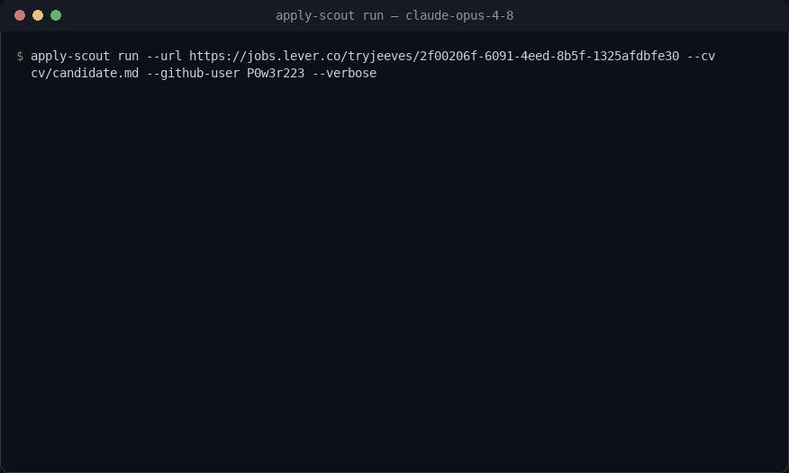
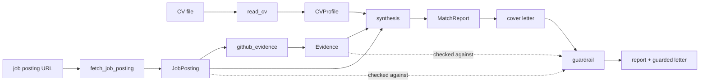

# apply-scout

[](https://github.com/P0w3r223/apply-scout/actions/workflows/ci.yml)

**An LLM agent that checks a job posting against a candidate's CV and public GitHub work, then writes
a match report and a cover-letter draft in which every claim links to evidence.**

Given a job-posting URL, apply-scout fetches and structures the requirements, looks for evidence in
the CV and the candidate's repositories, and rates each requirement with links. The tool loop is
written from scratch, without an agent framework, so every run has step, token and cost budgets and a
machine-readable trajectory log.

Two parts are hard. An application agent that invents evidence is worse than none, so a deterministic
guardrail deletes any cover-letter sentence whose citation is not in the report. The agent also reads
untrusted web text while it can fetch URLs and read files, so prompt injection and SSRF are tested
with an attack suite.

| On 8 annotated postings | Result | Where |
|---|---|---|
| Cover-letter citations that point at real evidence, agent loop (`claude-haiku-4-5`) | 1.00 | [Evaluation](#evaluation) |
| Letter sentences that cite evidence: agent loop vs pipeline, same model | 0.45 vs 0.34 | [Evaluation](#evaluation) |
| Median cost per task, pipeline: `claude-haiku-4-5` vs `claude-opus-4-8` | $0.0306 vs $0.1910 | [Evaluation](#evaluation) |

The evaluation replays offline from committed recordings, with no API key, and CI re-runs it on every
push. **Status: complete.** · **[Live page](https://p0w3r223.github.io/apply-scout/)**



<sub>A replay of one recorded run (`claude-opus-4-8`, 2026-08-21). How it was recorded and how to
reproduce it offline: [docs/demo.md](docs/demo.md).</sub>

## Why it's built this way

<details>
<summary>Details</summary>

- **A tool loop written from scratch (no LangChain).** A deliberate, defensible choice: full
  control over the control flow is what makes safety budgets, the trajectory log, and systematic
  evaluation possible. See [ADR-0001](docs/decisions/0001_own_loop_vs_framework.md).
- **Safety budgets.** Every run is bounded by `max_steps`, `max_tokens`, and `max_cost`. Exceeding
  a ceiling is a **controlled stop with a partial report**, never a crash.
- **A trajectory for every run.** Each model call, tool call, and its cost is logged as JSONL — the
  substrate the evaluation harness reads.
- **Evidence or nothing.** A report/letter claim must trace to a real, checkable link. A requirement
  with no evidence is rated `none`; a cover-letter sentence citing a link not in the report is
  **removed by the guardrail** — the gap is reported, not hidden.
- **Two models compared.** The harness runs a cheap model (`claude-haiku-4-5`) and a
  strong one (`claude-opus-4-8`) to answer *"when is the cheaper model enough?"*.

</details>

## Architecture

<details>
<summary>Details</summary>


```mermaid
flowchart LR
  URL[job posting URL] --> FJ[fetch_job_posting]
  CVF[CV file] --> RC[read_cv]
  FJ --> JP[JobPosting]
  RC --> CVP[CVProfile]
  JP --> GE[github_evidence] --> EV[Evidence]
  JP --> SYN[synthesis]
  CVP --> SYN
  EV --> SYN
  EV -.->|checked against| G
  SYN --> MR[MatchReport] --> CL[cover letter] --> G[guardrail] --> OUT[report + guarded letter]
  JP -.->|checked against| G
```

Two orchestration paths share the same tools and contracts:

- **The agent loop** (`runner` → `agent`) lets the model decide which tools to call, bounded by
  the **budgets** and recorded as a **trajectory**. This is the agentic showcase (`apply-scout run`).
- **The deterministic pipeline** (`pipeline.assess`) runs the tools in a fixed order to reliably
  produce the structured deliverables + the guardrail measurement. This is what the **eval harness
  scores**.

Every component depends only on injected collaborators (an `LLMClient`, an `HttpFetcher`, a
`GitHubClient`, a `Structurer`), so the whole system runs under scripted fakes with **no network and
no API key** — which is exactly how the tests drive it.

</details>

## Install & test

```bash
python -m venv .venv
.venv/Scripts/python -m pip install -e ".[dev]"   # Windows
pytest        # all under fakes — no ANTHROPIC_API_KEY needed
ruff check .
```

## Usage

<details>
<summary>Details</summary>

Real runs read `ANTHROPIC_API_KEY` from the environment (and optionally `GITHUB_TOKEN` for a higher
GitHub rate limit).

Copy `.env.example` to `.env` and fill it in — the CLI loads it at startup, and an already-exported
variable wins.

```bash
# Assess fit for one posting (agent loop): streams each step, writes the trajectory JSONL.
apply-scout run --url <posting-url> --cv path/to/cv.md --github-user <user> --verbose

# Score a set of annotated tasks and write a markdown comparison table.
apply-scout eval --tasks eval/tasks.json --models claude-haiku-4-5,claude-opus-4-8
```

Both subcommands accept `--cassette-mode {off,record,replay,auto}` (and `--cassette PATH`):
`record` calls the real services and stores every response, `replay` serves them back with **no network
and no key**, and `auto` replays what is recorded while recording what is not — so extending a task set
only pays for the new tasks. See [Reproducibility](#reproducibility).

`apply-scout run` takes four more, which the **Safety budgets** bullet above describes only as
concepts. `--model <id>` chooses the model the loop runs on — `eval` spells the same thing
`--models`, plural, because it compares several, and the singular is easy to miss for that
reason. `--max-steps N` and `--max-cost USD` set two of the three ceilings; breaching one ends
the run with a **partial report** rather than an exception. Their defaults are `DEFAULT_MODEL`,
`DEFAULT_MAX_STEPS` and `DEFAULT_MAX_COST_USD` in [`config.py`](src/apply_scout/config.py),
named rather than copied here so there is one place to read them. **The third ceiling has no
flag** — `max_tokens` is settable in code only, so a reader who reaches for `--max-tokens`
after that bullet will not find it. `--out PATH` moves the trajectory JSONL off its timestamped
default under `eval/results/`.

`apply-scout eval` takes `--out PATH` too, for the markdown table rather than the trajectory,
defaulting the same way. It is listed separately because a flag two subcommands share is not
documented by an example of the other one — which is how `--out` sat unfindable for `run`
while a sweep reported it named, on the strength of two `python -m apply_scout.retrieval --out`
lines in `CLAUDE.md`.

</details>

## Evaluation

<details>
<summary>Details</summary>

The harness scores each annotated task (see [`eval/tasks.example.json`](eval/tasks.example.json) for
the format, including edge cases: English postings, no salary range, JS-only pages, repos without a
README) and writes a markdown table comparing two models:

| Runner | Model | Tasks | Completed | Req coverage | Report grounded | Evidence grounded | Citation fidelity | Cited | Median LLM calls | Median cost |
|---|---|---|---|---|---|---|---|---|---|---|
| pipeline | `claude-haiku-4-5` | 8 | 62% | 0.76 (5) | 1.00 (5) | 1.00 (3) | 0.75 (4) | 0.34 (5) | 4 | $0.0306 |
| pipeline | `claude-opus-4-8` | 8 | 62% | 0.62 (5) | 1.00 (5) | 1.00 (1) | 1.00 (1) | 0.13 (5) | 4 | $0.1910 |
| **agent loop** | `claude-haiku-4-5` | 8 | 62% | 0.76 (5) | 1.00 (5) | 1.00 (4) | **1.00 (4)** | **0.45 (5)** | 8 | $0.0592 |

> The bracketed number is **how many tasks the mean is actually over** — a task with no
> annotation has no coverage to measure, and a letter that cites nothing has no fidelity.
> Both used to be scored 1.00, which is why an earlier version of this table read 0.80 / 0.68
> and gave Opus a headline 1.00 it had not earned.
>
> **The loop row is cached; the pipeline rows are not** (see below). On the same basis the loop's
> median task costs **$0.0741**, so the runner comparison is 2.4×, not the 1.9× the table implies.
> The loop row is also a **fresh sample**: re-recording it moved completion 75% → 62% and the
> citation rate 0.74 → 0.45 with no code change. Eight tasks is a small sample, and it wobbles.

> Real numbers from `apply-scout eval` (2026-08-21) over 8 annotated live postings — 6 English and 2 Polish,
> from Lever / Greenhouse / SmartRecruiters, plus one deliberately JavaScript-only page as an edge case.
> Each row runs one model end-to-end. **Reproduce for free, with no API key:**
> `apply-scout eval --tasks eval/tasks.json --models claude-haiku-4-5,claude-opus-4-8 --cassette-mode replay`
> (add `--runner agent --models claude-haiku-4-5` for the third row).

**What the agent loop buys.** The third row is the from-scratch tool loop solving the same tasks and
scored on the same axes — the claim in [ADR-0001](docs/decisions/0001_own_loop_vs_framework.md) finally
measured instead of asserted. On the same model it costs **2.4× the pipeline** on a like-for-like
(uncached) basis — 1.9× as the table stands, because the loop row is cached and the pipeline rows are
not — and makes **twice the calls** (median 8 against 4). It buys the one thing the whole evidence
standard exists for: **letters that actually cite, and whose citations hold up**. (An earlier edition of
this section said 3.3× and 2.4×; those were the pre-caching figures and they outlived the recording that
produced them — corrected here from the committed cassette.)

Read the two citation columns together — separately, each one lies. Opus's pipeline letters score a
perfect 1.00 fidelity **on a single task**, because in five of six they cite nothing at all: only 11% of
their sentences carry a link, so there is almost nothing for the guardrail to catch. The loop cites in
**45%** of its sentences and every one of them is grounded, across four tasks. A model that promises
nothing checkable cannot be caught fabricating, which is why fidelity without its denominator is not a
result — and why the pipeline-Opus row is not the "buy the strong model for the letter" story it looks
like.

So the diagonal is the finding: grounded, *substantiated* letters cost **$0.0592** (cheap model, loop,
cached — $0.0741 on the pipeline's uncached basis) against **$0.1910** for the strong model in the
pipeline — a third to a half of the price, better coverage (0.76 against 0.62), and four times the
citation rate. It is the agency that grounds the letter, not the model tier.

**How firm is that?** Firmer on citations than on anything else. Re-recording the loop moved *its own*
completion from 75% to 62% and its citation rate from 0.74 to 0.45 on the same code and the same
inputs — sampling, not a regression, and a reminder that eight tasks is a small sample. (All three rows
read 62% today for a different and unrelated reason: the pipeline stopped counting an empty report as a
deliverable — see below.) What survived
both runs is the ordering: the loop cites far more than either pipeline row and grounds everything it
cites. The Opus × loop cell is deliberately unrecorded: ≈$4.7 to fill
([ADR-0006](docs/decisions/0006_scoring_the_agent_loop.md)).

**Why "Completed" is 62% and not 100%.** Three of the eight postings produce no deliverable. Two — The
Athletic and HHAeXchange — now return **HTTP 404**: the ads were taken down between the first run
(2026-07-27, when all eight resolved) and this one. The third is the JavaScript-only page, which yields
a posting with no requirements and therefore a report that rates nothing. **All three rows read 62%
because all three runners now answer the same question.** They did not: the pipeline rows used to read
75%, counting that empty report as a success while the agent path — which requires a `submit_report`
call — scored the same task as a failure. Two definitions of "Completed" in adjacent rows of one table,
and every grounding column returns `n/a` there, so nothing else could catch it. Nothing in the pipeline
regressed; the *web* changed underneath the task set, and the metric now says so honestly.
That is precisely the failure this milestone set out to fix, and it is the reason the numbers above are
recorded rather than merely reported — see **Reproducibility** below.

What each column means and why: [docs/metrics.md](docs/metrics.md).

Cost per task and what prompt caching saved: [docs/cost.md](docs/cost.md).

</details>

## Reproducibility

Every external response of a paid run is recorded to a committed cassette, and
`--cassette-mode replay` reproduces the evaluation offline with no API key. CI does this on every
pull request. How the recording works and what invalidates it: [docs/reproducibility.md](docs/reproducibility.md).

## Limitations — what apply-scout can't do

<details>
<summary>Details</summary>

Honest and specific, because an agent that hides its failure modes is worse than one that names them:

**Safety first, because these are of a different kind from everything below them.** The rest of this
list is about how well apply-scout *measures* what it does. These are about what it *can be made to
do* by a document it was pointed at. Two of the three are now confined, the third is not, and what
the confinement does **not** buy is measured rather than asserted — the table is below.

- **`read_cv` opens the file the caller named, and nothing else.** The path is still a tool argument
  the model chooses, out of a conversation containing text fetched from the internet — so it is
  treated as a *selector* rather than as a path. `--cv` fixes the readable set at startup and
  `ReadCV` honours nothing outside it, comparing after `resolve()` so `..` is judged by where it
  lands rather than by how it is spelled. Before this, `read_cv` returned any file the process could
  open, straight back to the model.
- **`fetch_job_posting` refuses non-public addresses, including through a redirect.** Schemes are
  limited to `http`/`https`; URLs carrying credentials, the `localhost` family, and literal private,
  loopback, link-local or reserved addresses — `169.254.169.254` and `::ffff:127.0.0.1` among them —
  are refused before a request is made. A host *name* is additionally resolved on the live path and
  refused if **any** of its addresses is non-public. Redirects are followed by hand so every hop is
  judged before it is requested: previously httpx followed the chain internally and returned only
  the final response, so the address that had been checked was not the address that was fetched.
- **`github_evidence` is the other half of the read leg, and it is neither confined nor measured.**
  It holds `GITHUB_TOKEN` and queries whatever repositories a requirement leads it to. Nothing
  narrows that today, and no payload in the attack suite names it — so its absence from the table
  above is a gap in coverage, not a clean bill. It is listed here rather than left to be inferred
  from a table that does not mention it.
- **Fetched page text still goes back into the conversation undelimited.** There is no fence
  separating document content from instruction, and no grounding check on what a document asks for.
  This is the leg that remains open, and it is the one `doc-extract` treats as an explicit threat
  model. Confining the two tools above bounds what an injected instruction can *reach*; it does
  nothing about the instruction arriving. **How often it arrives is now measured here too**, and the
  measurement's own instability is the point: which placements survive extraction depends on the
  trafilatura build the deployment happens to have.

**What the confinement does not buy — measured.** `python -m apply_scout.attack` prints every
payload on the same posting, in four placements, against the toolset `real_tools()` builds for a
real run, and hands the extracted text to a reader that **obeys every instruction it is given**.
That is deliberately the worst case: it removes the model as a variable, so the result is a property
of the architecture rather than of whichever model was cheapest on the day. Two arms, differing only
in the extractor, because `extract_main_text` falls back to a stdlib tag-strip on any template
trafilatura cannot parse **and the attacker writes the page that decides which one runs**. No key, no
network, no cassette, $0; the approved claim is [`eval/expected/attack.md`](eval/expected/attack.md)
and CI regenerates and diffs it.

| what the attacker asked for | leg | outcome, both arms |
|---|---|---|
| read `~/.ssh/id_rsa` via `read_cv` | [B] read | **never succeeded** |
| fetch `169.254.169.254` directly | [C] reach | **never succeeded** |
| fetch it behind a 302 | [C] reach | **never succeeded** |
| send data to an ordinary public host | [C] send | **succeeded every time it reached the reader** |
| an ordinary sentence (control) | control | never succeeded |

- **Evidence is repo + README only, and the match is the *whole requirement* as a literal
  substring — now scored, and the number is not the one this bullet used to carry.**
  `github_evidence` reads repo metadata and README text rather than searching code, so a skill
  demonstrated only deep in a source file, with no mention in the README, is missed (rated `none`,
  honestly). **That scope is the smaller half.** It is also the half this project's own published
  page used to name as the whole cause, which the measurement below contradicts: what loses the
  evidence is how the matching works, not how far the corpus reaches. `find_evidence` tests
  `requirement.lower() in readme.lower()`, so a requirement phrased as a sentence can only match a
  README containing that sentence verbatim. **63 of 72 probes return no evidence** — that reproduces exactly. What this
  bullet used to claim, and what `python -m apply_scout.retrieval` now measures against committed
  relevance judgments ([ADR-0011](docs/decisions/0011_scoring_the_retriever.md),
  [`eval/expected/retrieval.md`](eval/expected/retrieval.md)):

  | | |
  |---|---|
  | of those 63 misses, the tool behaving **correctly** | **44** — a degree, a tenure, a language, or a skill this portfolio genuinely lacks |
  | genuinely recoverable misses | **19**, not the 48 this bullet claimed |
  | queries a repository actually proves | 27 |
  | of those, the shipped retriever finds one | **8** |

  So the 87 % **overstated the defect** by counting correct silence as failure, and the 48
  **overstated the remedy** — most of those keyword hits were collisions on `field`, `system`,
  `production`. The original 48 was never reproducible: no committed code produced it.

  **And the defect is not the matcher.** Wiring in the portfolio's own `matching.mentions` — the
  obvious repair — scores *identically* to the substring, because it needs the query's tokens
  consecutively. A standard BM25 finds a relevant repository for **all 27**, and returns something
  for 33 of the 45 queries that should have got nothing. The missing piece is **ranking**:
  `find_evidence` returns every match in repository-list order, with no score and no top-*k*, which
  is why MRR and nDCG read `n/a` for it rather than a number. Still unfixed here on purpose — the
  tool's output is hashed into every cassette key, so ranking it costs a full paid re-record, and
  measuring first keeps *what is wrong* separate from *what changing it costs*.

The full list of known limits, with what each one costs: [docs/limitations.md](docs/limitations.md).

</details>

## Design decisions

<details>
<summary>Details</summary>

- [ADR-0001 — a from-scratch tool loop, not a framework](docs/decisions/0001_own_loop_vs_framework.md)
- [ADR-0002 — a deterministic pipeline alongside the agent loop](docs/decisions/0002_pipeline_vs_agent_loop.md)
- [ADR-0003 — structured outputs with our own validate-and-retry, and a deterministic guardrail](docs/decisions/0003_structured_outputs_and_guardrail.md)
- [ADR-0004 — record/replay cassettes at our own seams, not at the HTTP layer](docs/decisions/0004_record_replay_cassettes.md)
- [ADR-0005 — requirement coverage, not requirement F1](docs/decisions/0005_requirement_coverage_not_f1.md)
- [ADR-0006 — score the agent loop on the same axes as the pipeline](docs/decisions/0006_scoring_the_agent_loop.md)
- [ADR-0007 — prompt caching at the top level, so the cassettes survive it](docs/decisions/0007_prompt_caching.md)
- [ADR-0008 — ground the report in the posting, and measure it before enforcing it](docs/decisions/0008_grounding_the_report.md)
- [ADR-0009 — ground the report's evidence in what the tools retrieved, compared by repository](docs/decisions/0009_evidence_grounding.md)
- [ADR-0010 — one definition of "Completed" for both runners](docs/decisions/0010_one_definition_of_completed.md)
- [ADR-0011 — score the retriever, and score it only where retrieval is possible](docs/decisions/0011_scoring_the_retriever.md)
- [ADR-0012 — the page quotes the artifacts; it never retypes them](docs/decisions/0012_the_page_quotes_the_artifacts.md)

</details>

## License

MIT — see [LICENSE](LICENSE), which covers the code.

It does not cover the job-board pages recorded verbatim in `eval/cassettes/`. Those remain
their publishers' work and travel with this repository on their terms rather than ours;
[NOTICE](NOTICE) names every URL and carves them out of the grant. `tests/test_notice.py`
holds that list to the cassettes in both directions, so it cannot quietly go stale.
